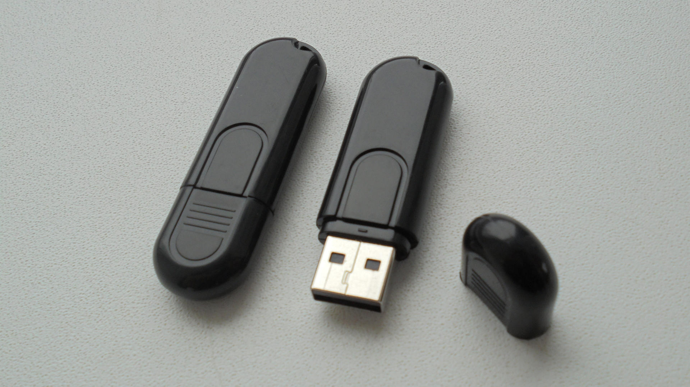
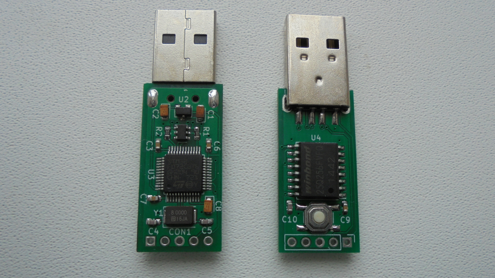

# PocketAdmin  
  
This is an open source keystroke injection device, similar to a well known [USB rubber ducky](https://shop.hak5.org/products/usb-rubber-ducky-deluxe)  
made by hak5. It looks and feels like an ordinary USB flash drive but acts as a keyboard that  
types in a preprogrammed payload. This can be very useful for automating sysadmin tasks or  
in penetration testing applications.  
  
  
  

The device here is intended to be a much improved verison of USB rubber ducky, namely:  

1. Made from inexpensive off-the-shelf parts, with not only open source firmware,  
but hardware design files as well. This allows the user to do substantial  
modifications to the design, as well as provides an option to build these yourself.  

2. Has a built-in interpreter (compatible with existing ducky script) which takes text files directly,  
so you never have to install any encoder software and keep converting payload.txt to inject.bin.  

3. Can act as both keyboard and USB disk, allowing for better payloads; the memory chip is integrated,  
so there is no need to keep sticking SD card in/out of various devices while developing payloads.  

4. Has an OS detection mechanism, which allows you to store multiple payloads simultaneously and  
have the device automatically pick the correct payload to run.  

5. Extended set of commands for extra functionality, such as: without doing any firmware update  
the user can set which VID / PID values to use, configure how the device should show up  
(keyboard only / flash disk only / keyboard+disk), change keyboard layout, and many other things.  

**CHECK THE [WIKI](https://github.com/krakrukra/PocketAdmin/wiki) FOR HOW-TO-USE INFORMATION**  

---

## hardware

project is designed using KiCad 5.0.2  
check KiCad pcb file for PCB manufacturing info  
check KiCad sch file + BOM.txt for component info  
  
uses integrated full-speed (12Mbit/s) USB2.0 peripheral,  
with on-board 32MiB flash memory chip for data storage;  
measured speeds for MSD access : read ~262.7 KiB/s, write ~66.8KiB/s.  
While not very fast, it is enough for most badusb applications.  
  
The pushbutton on the device is referred to as MSD-only button. Normally  
the payload is run whenever you plug the device into a PC. But if you press  
and hold this button while inserting the device, it prevents any keystrokes  
from being typed in.  
  
Fully assembled unit has dimensions of 59x18x9mm and weight of 8 grams.  
When opening up the case, be careful no to break the plastic studs near  
the USB connector and at the opposite (from USB) end of enclosure.  
  
hardware programmer device used in this project is [ST-Link V2](https://www.aliexpress.com/item/1PCS-ST-LINK-Stlink-ST-Link-V2-Mini-STM8-STM32-Simulator-Download-Programmer-Programming-With-Cover/32792513237.html?ws_ab_test=searchweb0_0,searchweb201602_2_10152_10151_10065_10344_10068_10342_10546_10343_10340_10548_10341_10696_10084_10083_10618_10307_10135_10133_10059_100031_10103_10624_10623_10622_10621_10620,searchweb201603_55,ppcSwitch_3&algo_expid=448b8f37-4a09-4701-bf7f-8b2ce2770a23-0&algo_pvid=448b8f37-4a09-4701-bf7f-8b2ce2770a23&priceBeautifyAB=0)  
For instructions on how to build and flash the device go check this video:  
[https://www.youtube.com/watch?v=cfud5Dq_w2M](https://www.youtube.com/watch?v=cfud5Dq_w2M)  
  
## firmware  
  
programming language used = C  
flashing software used = openocd  
IDE used = emacs text editor + Makefile  

the firmware was developed on debian 9.7 system, using gcc-arm-none-eabi toolchain  
(compiler, linker, binutils) and it does use gcc specific extentions.  
it was successfully compiled and tested with arm-none-eabi-gcc version 7.3.1  
  
depends on libgcc.a, which is included in this repository. linker script,  
startup code and openocd configuration files are included here as well.  
  
files usb\_rodata.h, hid\_rodata.h, msd\_rodata.h are not really  
headers, but integral parts of usb.c, main.c, msd.c respectively.  
they are not intended to be included in any other files.  
  
for your convenience, a pre-built binary firmware image is available in  
/extra/ directory. the name format is like this: firmware\_RRNNNNNNNNNN,  
RR stands for board revision, NNNNNNNNNN stands for firmware version.  
For example, firmware\_120000000002 means board revision 1.2, firmware version 2  
  
## directories info

#### /firmware/ --------------- contains makefile, linker script, source files; this is a build directory  

/firmware/cmsis/ ------- necessary header files from CMSIS compliant [STM32F0xx standard peripherals library](https://www.st.com/content/st_com/en/products/embedded-software/mcus-embedded-software/stm32-embedded-software/stm32-standard-peripheral-libraries/stsw-stm32048.html)  
/firmware/stdlib/ ---------- standard statically linked libraries (libgcc.a)  
/firmware/openocd/ ------- standard configuration files for openocd  
/firmware/fatfs/ ---------- [chan fatfs](http://www.elm-chan.org/fsw/ff/00index_e.html) filesystem module + custom W25Q256FVFG disk driver  
/firmware/usb/ ------------ custom USB stack, implementation of MSD and HID class devices  
/firmware/main/ ------- main application file, interrupt vector table, IRQ handlers and startup code  

#### /hardware/ ------------------- contains KiCad project, schematic, PCB files  

/hardware/PocketAdmin.symbols/ -- project specific symbol library  
/hardware/PocketAdmin.pretty/ --- project specific footprint library  
/hardware/PocketAdmin.panel/ ---  files for panelised version of PCB  
/hardware/gerbers/ ----------- gerber+excellon fabrication output files  

#### /extra/ -------------------  contains pictures, various extra documents, etc.  

/extra/examplePayloads/ ----------- some example PocketAdmin payloads  
/extra/pictures/ --------------------- device photos  
/extra/mechanicalDrawings/ -------- info for various mechanical parts  
/extra/fingerdb/ ------------------ OS fingerprint database  
/extra/kblayout/ ------------------ alternative keyboard layout files  
/extra/wikiPages/ ------------------ github wiki pages  
/extra/schematic\_\*.pdf ----------- pdf version of schematic  
/extra/firmware\_\* ----------- precompiled firmware image for PocketAdmin  
  
## contact info  
  
if you have a problem / question / feature request, here are your options for contacting me:  
send me an email to krakrukra@tutanota.com  
create a new github issue, or use of the existing one called [general discussion](https://github.com/krakrukra/PocketAdmin/issues/1)  
go to hackaday [project page](https://hackaday.io/project/165926-pocketadmin)  
go to my EEVblog [forum post](https://www.eevblog.com/forum/oshw/pocketadmin-an-open-source-keystroke-injection-device-badusb/)  
also, you can check out my [youtube channel](https://www.youtube.com/channel/UC8HZCV1vNmZvp7ci1vNmj7g)  
  
#### if you want to buy:  
  
tindie shop link: https://www.tindie.com/products/17300/  
  